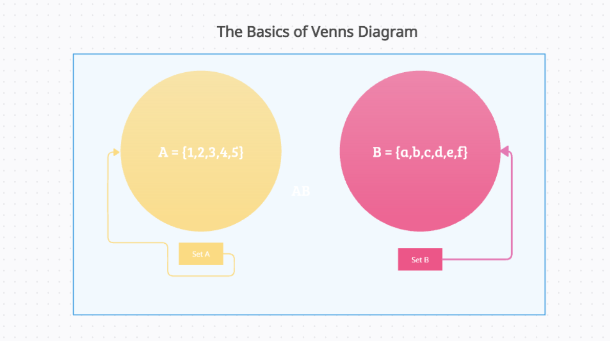
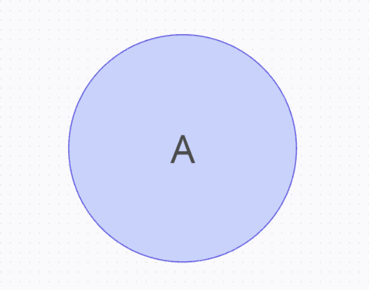
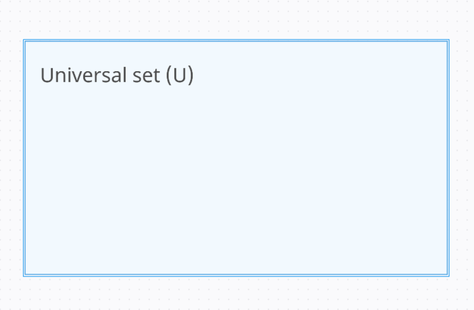
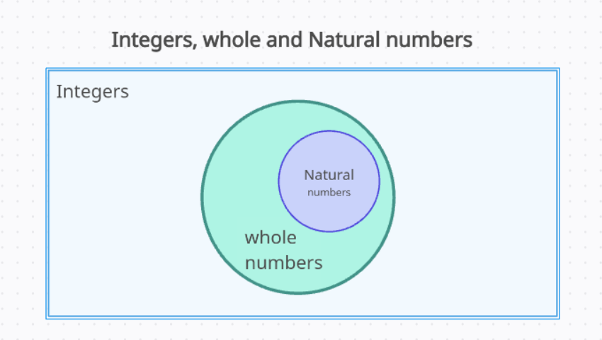
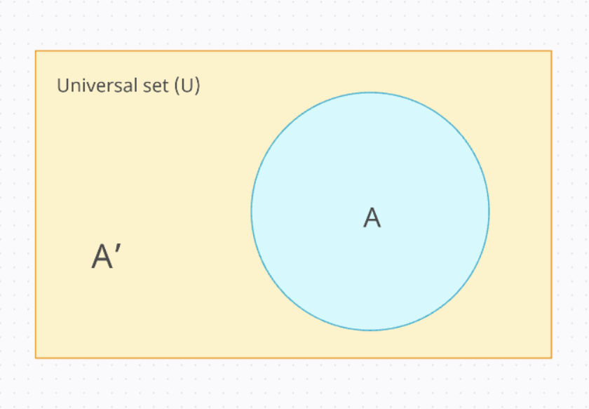

---
title: Venn Diagram and operations on sets
description: learning about Venn diagram.
tags:
  - sets
  - venn diagram
draft: false
---

## Venns Diagram

"`Venns diagram are visual tools to illustrate sets, relation between the sets and operations performed on them.`"

 Venn diagram, introduced by John Venn (1834-1883), uses circles (overlapping, intersecting and non-intersecting), to denote the relationship between sets, and all of this is contained in rectangle to denote [Universal set](subset-power-Universal-set##Universal set).

### Terms Related to Venn diagram

The concept of the Venn diagram is very useful for solving a variety of problems in Mathematics and other areas. To understand more about it, let's learn some important terms related to it.

#### Sets

`A set is collection of well defined mathematical objects.`
$$A = \{1,2,3,4,5,6,7\}$$

sets and set in general would be shown with the elements inside them or their variable names.
#### Universal set

`Universal Set is a large set that contains all the sets that we are considering in a particular situation.`

#### Subset

`Subset is actually a set of values that is contained inside another set.`

#### Complement of a Set

`Complementing a set means finding the value of the data present in the Universal set other than the data of the set.`

$A^c$ represents complement of A.

$$n(A^c) = U - n(A)$$
## Related posts

[[Why-Sets]]
[[set-representation]]

---

*These notes are for understanding concepts only and are not a replacement for your textbook or school classes.*